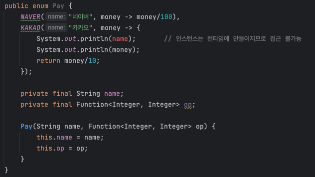

### 목차
- [함수 객체란](#함수-객체-function-object)
- [익명 클래스를 사용 했었던 때가 있었다.](#익명-클래스를-사용-했었던-때)
- [람다의 등장](#람다의-등장)
- [람다 사용 예제 : 열거 타입에서의 람다 사용](#열거-타입에서의-람다-사용)
- [람다 사용 시 유의사항](#람다-사용-시-유의사항)

## 함수 객체 (Function Object)
- Java 8 이전에는 *함수 타입*을 표현할 때, 추상 메서드를 하나만 담은 인터페이스를 사용했는데, 이런 인터페이스의 인스턴스를 함수 객체라고 한다.
- 특정 함수나 동작을 나타내는데 썼다.

<br>

## 익명 클래스를 사용 했었던 때
- JDK 1.1 부터 함수 객체를 만드는 주요 수단이 되었다.
- 단, 낡은 기법이며 익명 클래스 방식은 코드가 너무 길어 자바는 함수형 프로그래밍에 적합하지 않았다.
- 예시
  - 문자열을 길이순으로 정렬하는데, 정렬을 위한 비교 함수로 익명 클래스를 사용했다.
  - `Comparator` 인터페이스가 정렬을 담는 추상 전략을 의미하며, 문자열을 정렬하는 구체적인 전략을 익명 클래스로 구현했다.
    ```java
    @Test
    void 익명클래스를_함수객체로_사용() {
        List<String> words = new ArrayList<>(List.of("a", "abc", "bc", "ab"));
        Collections.sort(words, new Comparator<String>() {
            @Override
            public int compare(String o1, String o2) {
                return Integer.compare(o1.length(), o2.length());
            }
        });
        System.out.println(words);  // [a, bc, ab, abc]
    }
    ```

<br>

## 람다의 등장
- 자바 8 부터 추상 메서드가 하나만 선언된 인터페이스는 `함수적 인터페이스` 라는 특별한 의미로 인정 받게 되었다.
- 함수적 인터페이스의 인스턴스를 **람다식**(lambda expression)을 사용해 만들 수 있게 되었다.
- 함수나 익명 클래스와 개념은 비슷하지만 코드는 훨씬 간결하다.
- 예시
  - 컴파일러가 문맥을 살펴 타입을 추론해주는데, 상황에 따라 컴파일러가 타입을 결정하지 못할 때는 프로그래머가 직접 명시해줘야한다. 
    - 예제에서 반환값의 타입은 다음과 같지만, 코드 상 언급이 없다.
      - 람다 : `Comparator<String>`
      - 매개변수 (o1, o2) : `String`
      - 반환값 : `int`
    ```java
      @Test
      void 람다를_함수객체로_사용() {
          List<String> words = new ArrayList<>(List.of("a", "abc", "bc", "ab"));
          Collections.sort(words, (o1, o2) -> Integer.compare(o1.length(), o2.length()));
          System.out.println(words);  // [a, bc, ab, abc]
      }
    ```
- 타입을 명시해야 코드가 더 명확할 때만 제외하고는 **람다의 모든 매개변수 타입은 생략하자.**
  - 컴파일러가 '타입을 알 수 없다' 는 오류를 낼 때만 해당 타입을 명시하면 된다.
  - 반환값이나 람다식 전체를 형변환해야 할 때도 있겠지만 아주 드물다.
  - 컴파일러가 타입을 추론할 때에 필요한 타입 정보 대부분은 제네릭에서 얻는다.
    - 즉, 바로 위 예제에서 words 가 List<String> 이 아니라 List 였으면 컴파일 오류가 발생한다. (o1, o2 의 타입을 추론할 수 없으므로 String 의 `length()` 호출 불가)
    - 이와 같이 코드를 변경해야 오류가 발생하지 않는다.
    ```java
    List words = new ArrayList<>(List.of("a", "abc", "bc", "ab"));
    Collections.sort(words, (Comparator<String>) (o1, o2) -> Integer.compare(o1.length(), o2.length()));
    ```
- 코드를 더 간결하게 만들 수 있다.
  - 람다 자리에 비교자 생성 메서드를 사용
    - 예시
    ```java
    Collections.sort(words, Comparator.comparingInt(String::length));
    ``` 
  - 자바 8 때 List 인터페이스에 추가된 sort 메소드를 이용하면 더욱 짧아짐
  - 예시
    ```java
    words.sort(Comparator.comparingInt(String::length));
    ```

<br>

## 열거 타입에서의 람다 사용
- 상수마다 메서드의 행동을 다르게 해야하는 경우, 상수별 메서드 구현을 했었다. ([아이템34](/effective_java/Chapter%2006.%20열거%20타입과%20애너테이션/Item%2034.%20int%20상수%20대신%20열거%20타입을%20사용하라.md))
```java
public enum Operation {
    PLUS("+") {
        @Override
        public double apply(double x, double y) {
            return x + y;
        }
    },
    MINUS("-") {
        @Override
        public double apply(double x, double y) {
            return x - y;
        }
    };

    private final String symbol;

    @Override
    public String toString() {
        return symbol;
    }

    Operation(String symbol) { this.symbol = symbol; }

    public abstract double apply(double x, double y);
}
```
- 위 처럼 상수별 클래스 몸체를 구현하는 것보다, 열거 타임에 인스턴스 필드를 두는 편이 낫다. ([아이템34](/effective_java/Chapter%2006.%20열거%20타입과%20애너테이션/Item%2034.%20int%20상수%20대신%20열거%20타입을%20사용하라.md))
```java
public enum OperationWithLambda {
    PLUS("+", (x, y) -> x + y),
    MINUS("-", (x, y) -> x - y);

    private final String symbol;
    private final DoubleBinaryOperator op;
    // DoubleBinaryOperator 는 타입 인수 2개를 받아 double 타입 결과를 돌려주는 함수 인터페이스이다.
    
    @Override
    public String toString() {
        return symbol;
    }

    // 열거 타입 상수의 동작을 람다로 구현해 생성자에 넘기고, 생성자는 이 람다를 인스턴스 필드로 저장한다.
    OperationWithLambda(String symbol, DoubleBinaryOperator op) {
        this.symbol = symbol;
        this.op = op;
    }

    // 필드에 저장 된 람다를 호출하기만 하면 깔끔하게 처리할 수 있다.
    public double apply(double x, double y) {
        return op.applyAsDouble(x, y);
    }
}
```

<br>

## 람다 사용 시 유의사항
- 람다는 이름이 없고 문서화도 못한다.
  - 코드 자체로 동작이 명확히 설명되지 않거나, 코드 줄 수가 많아지면 람다를 쓰지 말아야 한다.
  - 람다는 한 줄일 때 가장 좋고, 길어야 세 줄 안에 끝내는 것이 좋다. (가독성 때문)
  - 람다가 길거나 읽기 어렵ㄹ다면 더 간단히 줄여보거나 람다를 쓰지 않는 쪽으로 리팩터링하자.
- 열거 타입 생성자 안의 람다는 열거 타입 인스턴스 멤버에 접근할 수 없다.
  - 열거 타입 생성자에 넘겨지는 인수들의 타입도 컴파일타임에 추론되기 때문이다. (인스턴스는 런타임에 만들어짐)
  - 상수별 동작을 단 몇 줄로 구현하기 어렵거나, 인스턴스 필드 혹은 메서드를 사용해야만 하는 상황이라면 `상수별 메서드 구현`을 하자.
  
- 추상 메서드가 하나만 선언된 `함수형 인터페이스`만이 람다의 타겟이 된다.
  - 추상 클래스의 인스턴스를 만들 때 람다를 쓸 수 없으므로 익명 클래스를 써야 한다.
  - 추상 메서드가 여러개인 인터페이스의 인스턴스를 만들 때도 익명 클래스를 쓸 수 있다.
- 람다는 자신을 참조할 수 없다.
  - 람다에서의 this 는 바깥 인스턴스를 가리킨다.
  - 익명 클래스에서의 this 는 익명 클래스의 인스턴스 자신을 가리킨다.
  - 즉, 함수 객체가 자신을 참조해야 한다면 반드시 익명 클래스를 써야 한다.
- 람다도 익명 클래스처럼 직렬화 형태가 구현별로 다를 수 있으므로, 람다를 직렬화하는 일은 극히 삼가야 한다.
